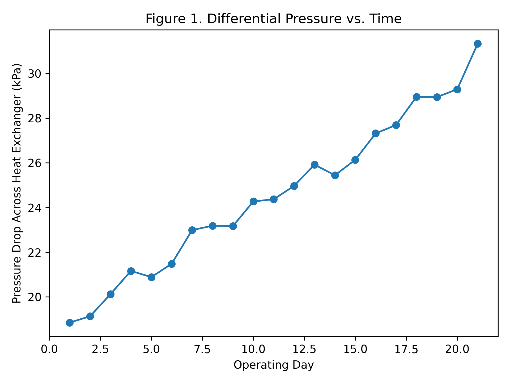
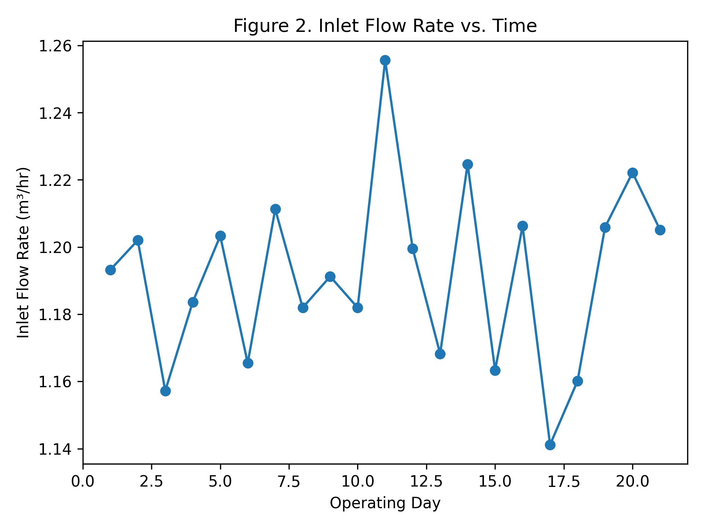

####**The following report is not related to your contamination analysis. It is provided solely to illustrate the expected style, organization, and level of reasoning for an excellent engineering analysis report. Do not attempt to use its structure as a fill-in template.**

## Executive Summary
An investigation was conducted to determine the cause of intermittent pressure drops in a closed-loop cooling system used to regulate temperature in a small-scale chemical reactor. Pressure and flow data collected upstream and downstream of a plate heat exchanger indicate that **progressive fouling within the exchanger** is the most likely cause of the observed performance degradation.

Measured pressure drop increased by nearly 70% over a three-week period while inlet flow rate and pump speed remained constant. A simple hydraulic model, supported by visual trend analysis, shows that the observed changes are inconsistent with pump failure or sensor drift but consistent with internal obstruction. The recommended corrective action is a controlled shutdown and inspection of the heat exchanger plates, followed by implementation of routine pressure-drop monitoring as an early warning metric.

---

## 1. Problem Background and Engineering Context
Maintaining stable operating conditions is critical for continuous-flow chemical systems. In this system, a recirculating water loop removes heat from an exothermic reactor via a plate heat exchanger. Operators reported sporadic alarms triggered by low downstream pressure, raising concerns about equipment reliability and safety margins.

The objective of this analysis was to:
- Identify whether the pressure drops were due to **instrumentation issues**, **pump performance**, or **flow restriction**
- Use available sensor data to support a defensible engineering conclusion
- Recommend an appropriate monitoring or mitigation strategy

---

## 2. Data Description and Assumptions
Pressure, flow rate, and pump speed were recorded once per shift over a three-week period. Measurements were taken at:
- Heat exchanger inlet
- Heat exchanger outlet

Key assumptions used in the analysis:
- Fluid properties (density and viscosity) remain constant
- Pump speed is directly proportional to nominal flow capacity
- Sensors were calibrated at the start of the monitoring period

These assumptions were validated where possible by examining trends in the raw data.

---

## 3. Data Analysis and Results

### 3.1 Pressure Trends
**Figure 1** (Pressure vs. Time) shows a steady increase in pressure drop across the heat exchanger, from approximately 18 kPa to over 30 kPa. Notably, this increase is monotonic rather than random, suggesting a physical process rather than measurement noise.

*Figure 1: Differential pressure across the heat exchanger as a function of operating time.*

### 3.2 Flow Rate Stability
Despite the rising pressure drop, the measured inlet flow rate remains approximately constant at 1.2 ± 0.03 m³/hr (**Figure 2**). This observation indicates that the pump is compensating for increased resistance, at least initially, and is therefore unlikely to be the root cause of the pressure anomaly.

*Figure 2: Inlet flow rate over time showing no significant downward trend.*

### 3.3 Evaluation of Alternative Explanations
Several hypotheses were evaluated:
- **Pump degradation:** Rejected due to stable flow rate and constant pump speed.
- **Sensor drift:** Unlikely, as both inlet and outlet sensors show coherent and opposing trends.
- **Flow restriction:** Supported by increasing pressure drop at constant flow.

A simplified Darcy–Weisbach analysis indicates that a ~40–50% reduction in effective flow area would be sufficient to produce the observed pressure increase, consistent with fouling or particulate accumulation.

---

## 4. Engineering Interpretation
The data strongly support internal fouling of the plate heat exchanger as the dominant cause of system performance degradation. The gradual nature of the pressure increase aligns with known fouling mechanisms such as scale formation or biofilm growth in cooling water systems.

Importantly, the system had not yet reached a failure condition, demonstrating how trend-based analysis can identify problems **before** operational limits are exceeded.

---

## 5. Recommendations
1. Schedule a planned shutdown to inspect and clean the heat exchanger plates.
2. Install automated tracking of differential pressure as a routine diagnostic metric.
3. Establish an action threshold (e.g., 25 kPa pressure drop) to trigger maintenance review.

These steps balance operational continuity with equipment protection and safety.

---

## 6. Conclusions
By integrating pressure and flow measurements with basic fluid mechanics principles, the source of intermittent pressure alarms was identified without invasive testing. This analysis highlights the value of combining quantitative data with engineering judgment to diagnose real-world system issues.

---

## References
1. Munson, B. R., Young, D. F., & Okiishi, T. H. *Fundamentals of Fluid Mechanics*.
2. Course Notes: Introduction to Engineering Data Analysis.

